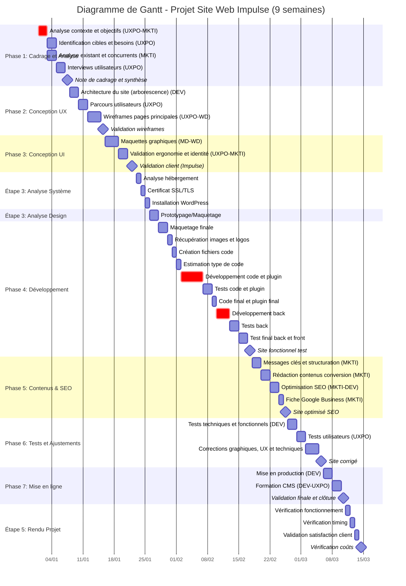
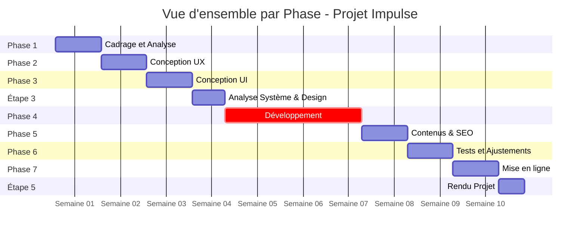

# Diagramme de Gantt - Projet Site Web Impulse

## Diagramme de Gantt Complet - Méthode en Cascade

## Diagramme de Gantt Simplifié par Phase

## Légende

- **Critique** (rouge) : Tâches critiques du projet
- **Milestone** (diamant) : Jalons importants et livrables
- **Durée totale** : 9 semaines (63 jours)

## Responsabilités par Phase

| Phase | Responsables | Durée |
|-------|-------------|-------|
| Phase 1 | UXPO, MKTI | 1 semaine |
| Phase 2 | DEV, UXPO, WD | 1 semaine |
| Phase 3 | MD, WD, UXPO, MKTI | 1 semaine |
| Étape 3 | DEV, UXPO, WD | 5 jours |
| Phase 4 | DEV | 3 semaines |
| Phase 5 | MKTI, DEV | 1 semaine |
| Phase 6 | DEV, UXPO, WD | 1 semaine |
| Phase 7 | DEV, UXPO | 1 semaine |
| Étape 5 | Tous | 4 jours |
